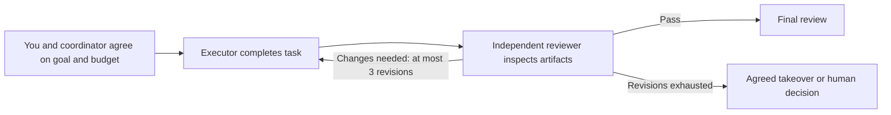

# multi-model-dev-framework

[简体中文](README.md) | **English**

**Divide development across AI models. Spend limited allowance on decisions that need it, with independent review of the results.**

Talk to one coordinator about your goals. Executors do the work; reviewers inspect the artifacts. You agree on models, effort, and project requirements before starting. The workflow is reusable across project types and model providers.

**The goal is to explore how multiple AIs can complete development with less allowance usage and better efficiency.** No benchmarks are complete. There is no promised saving percentage, and multiple models are not guaranteed to be faster than one.

> **Available today: a project kickoff skill, rules, project templates, and a manual collaboration workflow.** Model invocation, scheduling, counters, board updates, and timeout recovery are not implemented. There is no one-command launcher. Start by agreeing on a workflow profile, then manually trying one small task.

## Why use it?

| Development problem | Approach | Intended benefit |
| --- | --- | --- |
| A high-consumption model handles everything | Assign models and effort by task difficulty | Reserve allowance for complex judgment |
| Every AI rereads entire conversations and logs | File handoffs, relevant context, summaries for the coordinator | Reduce repeated input |
| Multiple AIs work without shared direction | One coordinator, separate execution and review | Reduce confusion and catch problems earlier |
| Revisions continue indefinitely | At most 3 revisions after initial submission, then agreed takeover or human decision | Bound rework and consumption |
| Each new project or model requires a new process | Separate project context and role mapping from shared rules | Reuse and adapt the workflow |

These are design choices, not measured results. Reviews and handoffs also cost time and usage; a single model may be more suitable for a tiny task.

## Recommended entry point: the kickoff skill

[Install the `multi-model-dev` skill](docs/skill.en.md), then send this in a new project session:

```text
$multi-model-dev
I want to build a new project: <your idea>. Help me agree on the first version, model assignments, and budget.
```

The skill helps fill the two input files through a short conversation and prepares first-task handoff prompts. Chinese and English are supported; automatic model dispatch is not implemented. **[Installation and testing guide](docs/skill.en.md)**.

## Without installing the skill: four manual steps

1. **Prepare your tools:** Git and AI coding tools/accounts you can actually use. Claude and context-mode are not required to begin.
2. **Prepare two inputs:** Download or clone this repository. Copy the project context and workflow profile from `templates/` into local `projects/<project-id>/`. Keep your target project's existing rule files intact.
3. **Agree with the coordinator:** Provide the goal, available models, and budget. Let it help complete the inputs, then confirm roles, acceptance criteria, and failure handling before execution.
4. **Try one small task:** Manually arrange execution and independent review. Save artifacts and summaries; compare quality, time, and consumption before adjusting the next run.

**Follow the [first-run guide](docs/quickstart.en.md)** for copy commands, a kickoff prompt, a small example, and common blockers. You do not need to read every design document first.

## Five things to watch during a run

| Watch | Question to answer | Where to look |
| --- | --- | --- |
| Goal and acceptance | What are we delivering, and what counts as done? | `PROJECT_CONTEXT.md` |
| Model assignments | Who coordinates, executes, and reviews, at what effort? | `WORKFLOW_PROFILE.md` |
| Budget and stopping | How many calls and how much time are allowed; when do we pause? | Workflow profile and run estimate |
| Quality and rework | Did the actual checks pass, and how many revisions have happened? | `reviews/` and validation evidence |
| Status and next action | What is complete, blocked, or waiting for my decision? | `summaries/`; the board is currently empty |

Keep one decision-making conversation with the coordinator. Full results stay in files for inspection when needed. Reviewers must still inspect actual artifacts, not approve solely from summaries.

## How a task flows



Coordinator, executor, and reviewer are **roles**, not fixed models. Astra coordinating, Luna executing small tasks, and Sol reviewing is one optional example. Sol or a verified available Claude model can also coordinate. Verify actual model IDs and account availability before use; examples are not an implemented compatibility matrix.

See the [workflow](docs/workflow.en.md) for full takeover, final review, and stopping rules.

## context-mode and future measurements

For long logs and large files, optional context-mode MCP tools can process and retrieve relevant excerpts to reduce raw text entering model context.

- [MCP usage, status verification, and statistics](docs/context-mode.en.md)
- [Latest upstream release and features](https://github.com/mksglu/context-mode/releases/latest) · [All release notes](https://github.com/mksglu/context-mode/releases)
- [How to compare usage, efficiency, and quality](docs/quickstart.en.md#how-to-check-whether-it-saves-usage-and-time)

The skill explains tradeoffs and asks whether to install context-mode. After opt-in, the AI uses host tools to install and verify each integration layer, reporting required restart or trust actions. Cloning the repository alone does not install or enable it. Fewer context tokens do not establish subscription allowance savings. The maintainer will compare configurations on real tasks and update guidance with the findings.

## Reference files, when you need them

| File | Purpose |
| --- | --- |
| [Skill installation and testing](docs/skill.en.md) | Set up a project through conversation |
| [First-run guide](docs/quickstart.en.md) | Preparation through a manual trial |
| [Project context template](templates/PROJECT_CONTEXT.en.md) | Goals, constraints, and acceptance |
| [Workflow profile template](templates/WORKFLOW_PROFILE.en.md) | Roles, models, budget, and failure handling |
| [Workflow](docs/workflow.en.md) | Review, revision, and takeover rules |
| [AGENTS.md](AGENTS.md) / [English](docs/AGENTS.en.md) | AI rules and Codex entry point |
| [CLAUDE.md](CLAUDE.md) / [English](docs/CLAUDE.en.md) | Claude rules; adapter not implemented |
| `projects/` | Local project context and profiles |
| `tasks/`, `outputs/`, `reviews/`, `summaries/` | Tasks, full results, reviews, and summaries |
| `board.md` / `scripts/` | Empty board / future script placeholder |

Local project inputs and task records are ignored by Git by default; still inspect actual files before publishing. No personal project background or special capability is enabled globally.

## Feedback and contributions

Use [Issues](https://github.com/jake2ace/multi-model-dev-framework/issues) for suggestions, onboarding problems, or sanitized trial results. Submit changes as PRs; **the repository owner decides whether to merge into `main`.**

See [Contributing](CONTRIBUTING.en.md). GitHub permissions are configured separately; documentation does not grant or restrict account access.

## License

The custom [Multi-Model Dev Framework Source-Available License 1.0](LICENSE) permits learning, modification, free redistribution, and use for commercial development or client work. Independent outputs can be sold without adopting this license merely because the framework helped produce them.

Selling, paid redistribution, or paid sublicensing of the framework or modified versions is prohibited, as is offering them as paid hosted, subscription, or API services, including bundles. Preserve the license and notices when redistributing. Provided as is, without warranty.

This is a summary; the English LICENSE controls. It is source-available, not MIT or an OSI-approved open-source license. Third-party tools, models, and services retain their own terms.
